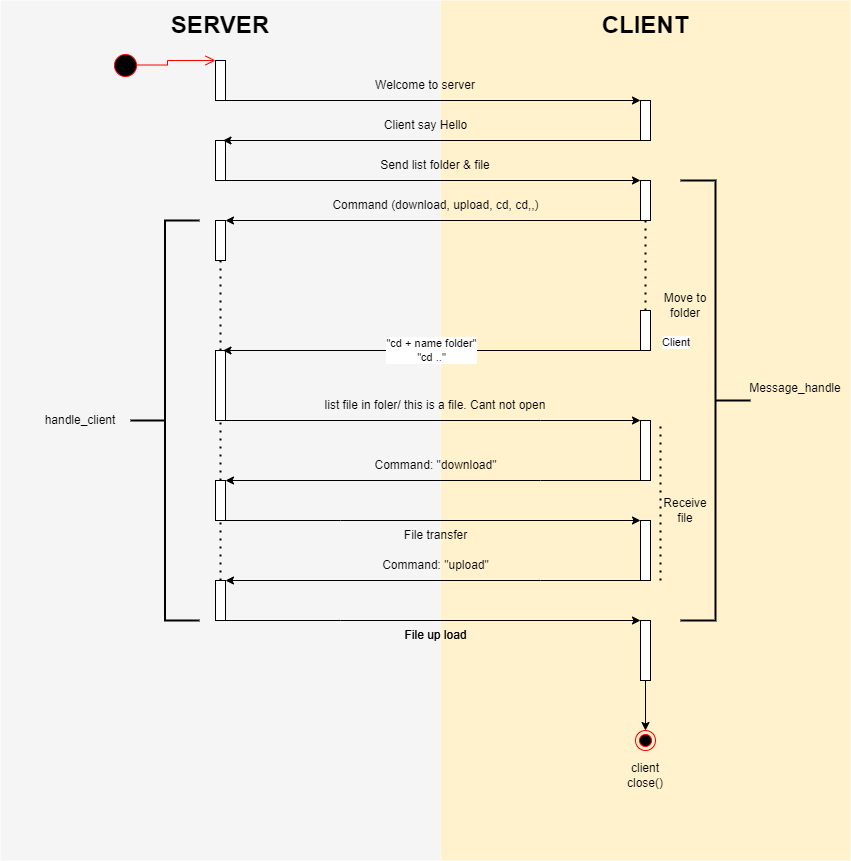

# SERVER TO CLIENT

## Chạy chương trình

Server:
```
cd server/
sudo python3 server.py
```

Các Clients:
```
cd clients/
sudo python3 client.py
```

## Communication between client and server


## Flow data



**SERVER**
1. Connect to client by socket (socket, threading)
2. As soon as a thread connects, the server will call the **handle_client function** to execute
3. Check **request** from client and execute
   **request** = "download"
   **request** = "upload"

**CLIENTS**
1. Connect to server
2. Send command
3. Receive data and save - not done

<!-- **Protocol**

|Byte+0|Byte+1|Byte+2|Byte+3|
|------|------|------|------|
|Content Type|ID|Check|Payload|
 -->


#### ***Note**
Các việc cần làm:
+ Thêm các lệnh để tìm file:
    Command 'cd' để mở một thư mục
    Lệnh 'rm' để xoá file trên server
    ...
+ Mã hoá cho từng kết nối giữa Client và Server
    Sử dụng OPEN VPN hoặc OPEN SSL/TLS

***Link***
https://www.youtube.com/watch?v=Ah3iz3pKljU